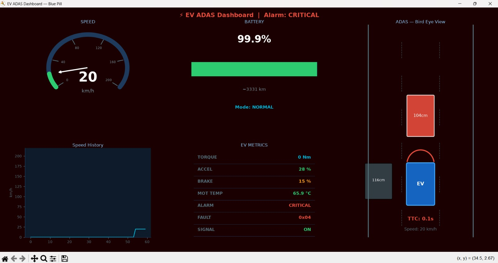
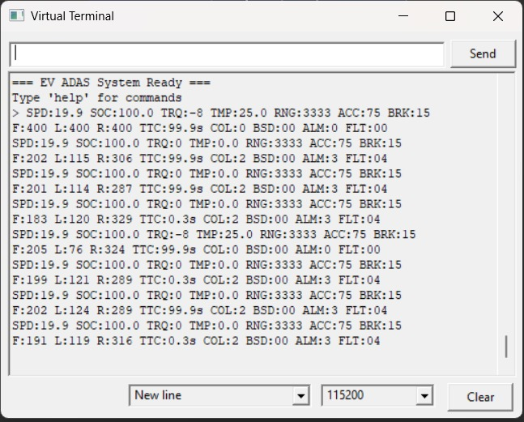
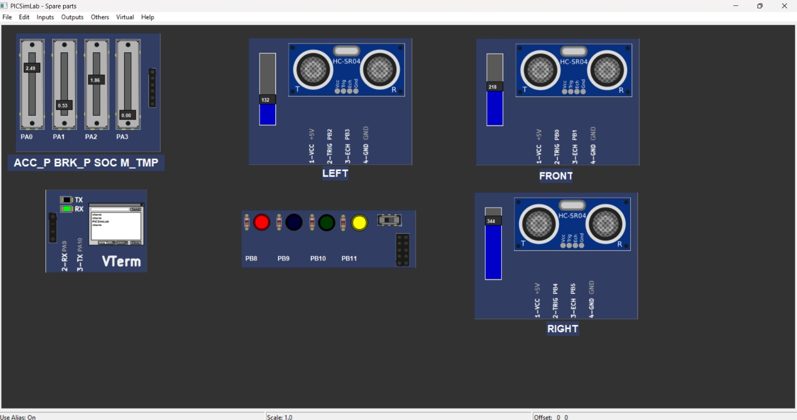

 Real-Time EV Dashboard and ADAS Warning System

A real-time electric vehicle dashboard simulation built using **STM32 Blue Pill (STM32F103C8T6)** and **Python**, featuring live vehicle monitoring and an ADAS (Advanced Driver Assistance System) safety warning interface.

📌 Overview

This project simulates an intelligent EV dashboard that monitors key vehicle parameters in real time and displays them through an interactive graphical interface, while also providing safety alerts for potential collisions using a simulated ADAS system. The STM32 handles real-time data acquisition and transmits it over UART to a Python-based GUI for visualization.

✨ Key Features

- 📊 **Real-Time Speedometer** — Live speed visualization updated continuously
- 🔋 **Battery Monitoring & Range Estimation** — Tracks battery level and estimates remaining driving range
- 🚘 **ADAS Bird's-Eye View** — Visual obstacle detection display around the vehicle
- ⚠️ **Collision Warning & Alarm System** — Real-time alerts triggered when obstacles are detected within a critical range

🛠️ Tech Stack

| Component | Technology |
| Microcontroller | STM32 Blue Pill (STM32F103C8T6) |
| Firmware | Embedded C (STM32CubeIDE / HAL Drivers) |
| Communication | UART |
| GUI / Visualization | Python |
| Development Environment | STM32CubeIDE |

⚙️ How It Works

1. The STM32 microcontroller reads sensor/input data (speed, battery level, obstacle proximity).
2. This data is transmitted to a host machine over UART.
3. A Python application receives the data and renders it on a real-time GUI dashboard.
4. When an obstacle is detected within a defined threshold, the system triggers a collision warning and alarm.

📂 Repository Contents

| File | Description |
|---|---|
| `project.py` | Python GUI dashboard application |
| `ev_dash.ioc` | STM32CubeMX pin/peripheral configuration |
| `STM32F103C8TX_FLASH.ld` | Linker script for the STM32F103C8T6 |
| `.project` / `.cproject` / `.mxproject` | STM32CubeIDE project files |
| `Dashboard.jpeg` | Screenshot of the live dashboard interface |
| `Virtual_term.jpeg` | Screenshot of the virtual terminal / data output |
| `Spare_Parts.jpeg` | Hardware components used in the build |

🖥️ Demo

Screenshots





Video Demo

<!-- Replace the link below with your actual YouTube/Drive video link -->
[Watch the demo video](https://your-video-link-here)

🚀 Getting Started

Hardware Required
- STM32 Blue Pill (STM32F103C8T6)
- ST-Link programmer
- USB-to-serial adapter (if not using onboard USB)

Software Required
- STM32CubeIDE
- Python 3.x
- Required Python libraries (update based on what your `project.py` actually imports):
```bash
pip install pyserial matplotlib
```

Setup Instructions

1. Clone the repository
```bash
git clone https://github.com/druvanm/-Real-Time-EV-Dashboard-and-ADAS-Warning-System-.git
```

2. Open the firmware project
   - Open STM32CubeIDE
   - Go to `File → Open Projects from File System`
   - Select the cloned repository folder (containing `.project`, `.cproject`, `ev_dash.ioc`)
   - Build and flash to your STM32 Blue Pill using ST-Link

3. Run the Python dashboard
```bash
python project.py
```

> Note:This repository currently contains the project configuration files (`.ioc`, linker script, CubeIDE project files) and the Python GUI. The core firmware source (`main.c` and header files) will be added soon for a fully buildable project.

🔮 Future Improvements

- [ ] Add main.c and header source files for a complete buildable firmware project
- [ ] Add real sensor integration for live obstacle detection
- [ ] Implement CAN bus communication
- [ ] Add data logging for trip history
- [ ] Improve GUI responsiveness and add themes

👤 Author

Druvan M
- GitHub: [@druvanm](https://github.com/druvanm)
- LinkedIn: www.linkedin.com/in/druvan-m-abbb70210

---

⭐ If you found this project interesting, consider giving it a star!
